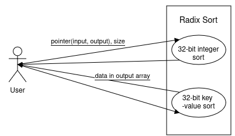

# High Level Design Documentation

This document provides an abstract overview of the library's functions. It defines how the user can utilize the library and how those functionalities are implemented.

## User API

The user gets access to two functions:

1) `rsort_u32:` Takes a pointer to the array the user wants to sort, along with a pointer to output array and the number of elements they want sorted. It performs a Radix sort and stores the sorted array in the location specified by the output pointer.
2) `rsort_u32_kv`: This accepts two pointers for each input and output, one for an array that represents keys and another than holds values corresponding to those keys. It stores the sorted data array and the keys in the given output pointers, where the value of the keys array corresponds to the new location of the data in the data array.

    

## Architecture

The library exposes two API endpoints to the user, upon receiving a call from one of them, it immediately extracts the size of the input and allocates memory on the device (GPU). This version of Radix sort employs a 4-bit key, this means a total of 8 passes for 32 bit integers. 

A pass executes the following:

 - A histogram generation step that drops a partition's values into their respective buckets based on the key.
 - Every partition performs the decoupled lookback by executing concurrent local value aggregation, followed by partition look backs to get the final exclusive prefix sum.
 - Based on the prefix sum, all values are scattered to their correct indices. In case of a key-value sort, the keys follow the scatter indices used by the data array.
 - Finally, the input and output buffers are swapped so the next pass can begin with the newly generated values.

Once all the passes are over, the final output is written to the memory address specified by the host.

    

## Modules

